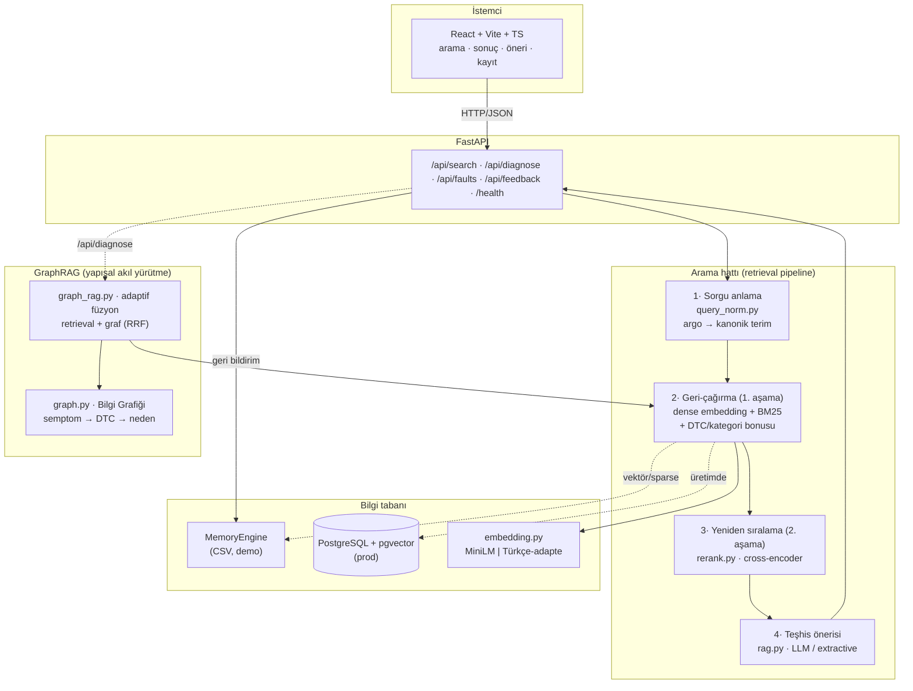

# AutoDiag — Otomotiv Arıza Teşhis Destek Sistemi

NLP tabanlı **benzer vaka bulma + teşhis önerisi** sistemi. Teknisyen bir arızayı
kendi cümleleriyle yazar; sistem geçmiş çözülmüş vakalar içinden **iki aşamalı
hibrit arama** ile en benzerlerini bulur ve **sentezlenmiş bir teşhis önerisi**
üretir.

> ⚠️ **Dürüst çerçeve:** Sistem teşhis **koymaz**; geçmiş benzer vakaları bulup
> özetler. Nihai karar teknisyene aittir. Veri prototip aşamasında sentetiktir
> (gerçek OBD-II DTC referansından şablonla üretilmiştir).

---

## Öne çıkanlar

- **İki aşamalı retrieval:** hızlı hibrit geri-çağırma (dense embedding + BM25 +
  DTC/kategori bonusu) → cross-encoder ile yeniden sıralama.
- **Sorgu anlama:** Türkçe otomotiv argosunu kanonik terimlerle genişletir
  (domain gap'i çıkarımda kapatır).
- **Domain-adapte embedding:** çok dilli MiniLM, Türkçe arıza alanına fine-tune
  edilmiştir (opsiyonel).
- **RAG teşhis önerisi:** benzer vakalardan olası neden + adımlar + güven; LLM
  yoksa extractive fallback.
- **DB'siz demo:** Postgres olmadan, bellek-içi motorla tam çalışır; prod'da aynı
  arayüzle pgvector'e geçer.
- **Titiz değerlendirme:** ablation + domain gap analizi (P@k, MRR, nDCG@5).

---

## Mimari



**Akış:** sorgu → genişletme → hibrit geri-çağırma (top-N aday) → cross-encoder
rerank (top-k) → RAG öneri → yanıt. Geri bildirim ileride re-ranking sinyali olur.

---

## Teknoloji

| Katman | Teknoloji |
|--------|-----------|
| Backend | Python 3.12, FastAPI, Pydantic v2 |
| NLP | sentence-transformers (`paraphrase-multilingual-MiniLM-L12-v2`, 384d), cross-encoder (`mmarco-mMiniLMv2-L12`), rank-bm25 |
| Veri tabanı | PostgreSQL + pgvector (prod) · bellek-içi motor (demo) |
| Frontend | React + Vite + TypeScript (harici UI kütüphanesi yok) |
| Değerlendirme | numpy, scikit-learn, matplotlib |

---

## Kurulum ve çalıştırma

### 1) Backend

```bash
cd backend
python -m venv .venv && source .venv/bin/activate
pip install -r requirements.txt
uvicorn app.main:app --reload --port 8000      # http://localhost:8000/docs
```

Başlangıçta `data/faults_dataset.csv` (yoksa `faults_seed.csv`) yüklenir. DB
gerekmez.

### 2) Frontend

```bash
cd frontend
npm install
npm run dev                                     # http://localhost:5173
```

### Ortam değişkenleri (`backend/.env`, opsiyonel)

```
# EMBEDDING_MODEL=adapted     # domain-adapte modeli kullan (önce fine-tune et)
# LLM_API_KEY=sk-ant-...      # RAG için gerçek LLM (yoksa extractive fallback)
# DATABASE_URL=...            # prod pgvector
```

---

## Veri

| Dosya | İçerik |
|-------|--------|
| `data/faults_seed.csv` | 152 kürasyonlu çekirdek vaka (8 kategori × 19) |
| `data/dtc_reference.csv` | 72 gerçek OBD-II DTC kodu (belirti/neden/önem) |
| `data/faults_generated.csv` | Referanstan üretilmiş 657 vaka |
| `data/faults_dataset.csv` | Birleşik korpus (809 vaka) — uygulamanın kullandığı |
| `data/real/zenodo_faults.csv` | **Gerçek** veri: 99 vaka (Zenodo, CC-BY 4.0) — çapraz-dilli doğrulama |

> Gerçek veri içe aktarımı: `python scripts/import_zenodo.py` (atıf:
> `data/real/ATTRIBUTION.md`).

Veriyi yeniden üret (deterministik, seed=42):

```bash
python scripts/generate_dataset.py --per-code 9
```

---

## Değerlendirme

```bash
cd eval
python run_ablation.py          # BM25/Dense/Hibrit/+Rerank + QN, standart vs zorlu
python run_finetune_eval.py     # base vs domain-adapte embedding
```

Özet bulgular (ayrıntı: [`eval/README.md`](eval/README.md)):

- **Bileşen ablation:** Hibrit > Dense > BM25.
- **Zorlu (argo) sorgular:** rerank MRR +%32; **sorgu genişletme nDCG +%111**;
  **domain-adaptation dense nDCG +%179**. QN + adaptation istiflenir
  (en iyi MRR 0.32 → 0.54).

---

## Embedding domain-adaptation (opsiyonel)

```bash
python scripts/finetune_embedding.py --epochs 2     # models/autodiag-embed-tr/
# sonra: backend/.env → EMBEDDING_MODEL=adapted
```

---

## Testler

```bash
cd backend
pytest                          # 30 test (birim + entegrasyon), DB'siz
```

Kapsam: metin normalizasyonu, embedding boyutu, min-max normalize, hibrit
skorlama + DTC/kategori bonusu, sorgu genişletme, ve tüm REST uçları.

---

## Proje yapısı

```
autodiag/
├── backend/
│   ├── app/
│   │   ├── api/            search · faults · feedback · deps
│   │   ├── services/       embedding · retrieval · memory_store · rerank · query_norm · rag · graph · graph_rag
│   │   ├── schemas.py      Pydantic v2 istek/yanıt modelleri
│   │   ├── models.py       SQLAlchemy (prod pgvector yolu)
│   │   └── main.py         FastAPI uygulaması + lifespan
│   ├── tests/              pytest (birim + entegrasyon)
│   └── requirements.txt
├── frontend/               React + Vite + TS arayüz
├── data/                   DTC referansı + veri kümeleri + üretici
├── scripts/                generate_dataset.py · finetune_embedding.py
└── eval/                   ablation · finetune-eval · gold/hard setleri · grafikler
```

---

## Sınırlamalar

- **Sentetik veri.** Korpus, gerçek OBD-II DTC referansından **şablonla** üretildi.
  Gerçek serviste gerçek atölye kayıtlarıyla beslenmelidir.
- **Sistem teşhis koymaz.** Yalnız benzer geçmiş vakaları bulup özetler; sorumluluk
  teknisyendedir.
- **Değerlendirme ağırlıklı sentetik.** Göreli katkılar (ablation, QN,
  domain-adaptation) kanıtlandı; ek olarak bağımsız gerçek veride (Zenodo CC-BY)
  çapraz-dilli doğrulama yapıldı (Faz İ2). Geniş ölçekli Türkçe gerçek-veri
  doğrulaması gelecek iştir.
- **LLM opsiyonel.** Anahtar yoksa RAG, vakalardan extractive özet üretir
  (uydurma yapmaz).
- **Prod DB yolu** (`models.py`, pgvector) kodlanmış ancak canlı bağlanması bulut
  Postgres bağlantısı bekliyor; demo bellek-içi motorla çalışır.
